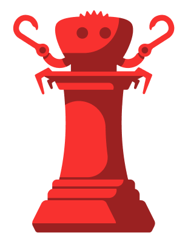

# Rough Hook

<div align="center">
  
  
  **A Comprehensive Research Framework for Evaluating Kolmogorov-Arnold Networks (KANs) in Chess-Related Applications**
</div>

## Table of Contents

- [Overview](#overview)
- [Research Objectives](#research-objectives)
- [Project Architecture](#project-architecture)
- [Installation](#installation)
  - [System Requirements](#system-requirements)
  - [Dependencies Installation](#dependencies-installation)
  - [Project Setup](#project-setup)
- [Project Components](#project-components)
  - [Rusty Brain - Chess Engine](#rusty-brain---chess-engine)
  - [Hook Lens - Computer Vision](#hook-lens---computer-vision)
  - [Rough Guard - Behavioral Analysis](#rough-guard---behavioral-analysis)
- [Databases](#databases)
- [Scripts](#scripts)
- [Usage Examples](#usage-examples)
- [Research Results](#research-results)
- [Contributing](#contributing)
- [License](#license)

## Overview

**Rough Hook** is a comprehensive research project that empirically evaluates Kolmogorov-Arnold Networks (KANs) across three distinct domains: chess engine evaluation, computer vision classification, and behavioral anomaly detection. This project provides rigorous real-world performance assessment of KANs as a promising alternative to traditional Multi-Layer Perceptrons (MLPs).

## Research Objectives

This research addresses the critical need for empirical validation of KANs across diverse applications by implementing three modular systems:

1. **Chess Engine Evaluation**: Comparing HCE (Hand-Crafted Evaluation), NNUE, and KAN architectures
2. **Computer Vision Classification**: Evaluating CNN+MLP vs CNN+KAN for chess piece recognition  
3. **Behavioral Anomaly Detection**: Assessing MLP vs KAN for chess cheating detection

### Key Research Questions
- Can KANs replace traditional evaluation functions in chess engines?
- Do KANs offer advantages in computer vision tasks when computational overhead is justified?
- How do KANs perform in behavioral pattern recognition compared to MLPs?

## Project Architecture

```
rough_hook/
├── rusty_brain/          # Chess engine with switchable evaluation functions
├── hook_lens/            # Computer vision pipeline for chess piece classification  
├── rough_guard/          # Behavioral anomaly detection system
├── databases/            # Training and evaluation datasets (see setup instructions)
├── scripts/              # Data preprocessing and augmentation scripts
├── nnue_models/          # Pre-trained NNUE neural network models
└── assets/               # Project assets and documentation
```

## Installation

### System Requirements

- **Operating System**: Linux (Ubuntu 20.04+ recommended)
- **Rust**: Latest stable version
- **Python**: 3.8+
- **CUDA**: 12.0+ (for GPU acceleration)
- **Memory**: 16GB+ RAM recommended
- **Storage**: 50GB+ free space (for datasets)

### Dependencies Installation

#### 1. Install Rust
```bash
curl https://sh.rustup.rs -sSf | sh
source $HOME/.cargo/env
```

#### 2. Install System Dependencies
```bash
# Essential build tools
sudo apt update
sudo apt install git build-essential libssl-dev pkg-config

# Python and virtual environment
sudo apt install python3-pip python3-venv

# Mathematical libraries for KAN operations
sudo apt install gfortran
sudo apt-get install libatlas-base-dev libblas-dev liblapack-dev

# Computer vision dependencies
sudo apt install libopencv-dev clang libclang-dev
```

#### 3. Install NVIDIA CUDA Toolkit (for GPU acceleration)
```bash
# Install NVIDIA toolkit (easier method)
sudo apt install nvidia-cuda-toolkit
```

### Project Setup

#### 1. Clone the Repository
```bash
git clone https://github.com/y0sif/rough_hook.git
cd rough_hook
```

#### 2. Build the Project
```bash
# Build all components
cargo build --release

# Or build individual components
cargo build -p rusty_brain --release
cargo build -p hook_lens --release  
cargo build -p rough_guard --release
```

#### 3. Verify Installation
```bash
# Test the chess engine
cargo run -p rusty_brain --release

# Run computer vision tests
cargo test -p hook_lens --release

# Test behavioral analysis
cargo test -p rough_guard --release
```

## Project Components

### Rusty Brain - Chess Engine

A complete UCI-compliant chess engine with switchable evaluation functions.

**Features:**
- Bitboard representation with magic bitboards for sliding pieces
- Alpha-beta search with iterative deepening
- Transposition tables for search optimization  
- Multiple evaluation functions: HCE, NNUE, and KAN
- UCI protocol support for chess GUI integration

**NNUE Training:**
NNUE models are trained using the Bullet ML framework: https://github.com/jw1912/bullet
Note: Unlike Hook Lens and Rough Guard, NNUE training does not use the Burn framework.

**Running the Engine:**
```bash
# Start UCI mode
cargo run -p rusty_brain --release

# Run performance tests
cargo test -p rusty_brain --release

# [Placeholder: Benchmark evaluation functions - command line arguments to be added]
```

**Key Files:**
- `src/board.rs` - Chess board representation
- `src/alphabeta.rs` - Search algorithm implementation
- `src/evaluation.rs` - Hand-crafted evaluation function
- `src/nnue.rs` - NNUE integration
- `src/uci.rs` - UCI protocol implementation

### Hook Lens - Computer Vision

Computer vision pipeline for analyzing chess board images and extracting positions.

**Features:**
- Automated chess board detection and square extraction
- CNN+MLP vs CNN+KAN architecture comparison
- Chess piece classification across 13 classes (6 white, 6 black, empty)
- FEN string generation from board images
- Real-time inference capabilities

**Training Models:**
```bash
# [Placeholder: Train CNN+MLP model - command line arguments to be added]

# [Placeholder: Train CNN+KAN model - command line arguments to be added]

# Test trained models
cargo test -p hook_lens --release
```

**Using for Inference:**
```bash
# [Placeholder: Analyze a chess board image - command line arguments to be added]
```

**Key Files:**
- `src/data_and_model/model.rs` - CNN and KAN model architectures
- `src/data_and_model/training.rs` - Training pipeline
- `src/input_data_handling/board_square_extracting.rs` - Image preprocessing
- `src/input_data_handling/fen_string_generation.rs` - FEN generation

### Rough Guard - Behavioral Analysis

Behavioral anomaly detection system for identifying chess cheating patterns.

**Features:**
- MLP vs KAN classifier comparison for cheat detection
- Feature extraction from chess game behavioral data
- Support for multiple behavioral metrics (time patterns, move accuracy, etc.)
- Class imbalance handling with weighted loss functions

**Training Models:**
```bash
# [Placeholder: Train MLP classifier - command line arguments to be added]

# [Placeholder: Train KAN classifier - command line arguments to be added]

# Evaluate models
cargo test -p rough_guard --release
```

**Key Files:**
- `src/model.rs` - MLP and KAN model definitions
- `src/training.rs` - Training pipeline with class balancing
- `src/data.rs` - Data loading and preprocessing
- `src/inference.rs` - Model inference and evaluation

## Databases

The project requires several large datasets that are stored externally due to size constraints:

**Download Required Datasets:**
```bash
# Create databases directory if it doesn't exist
mkdir -p databases

# Download from provided Google Drive link
# [Add your Google Drive link here]
# Extract to databases/ folder
```

## Scripts

The `scripts/` directory contains data preprocessing and augmentation utilities:

**Planned Scripts:**
- [Placeholder: Script implementations to be added based on research needs]

## Usage Examples

### Example 1: Chess Engine Analysis
```bash
# Start the engine in UCI mode
cargo run -p rusty_brain --release

# In UCI interface:
uci
isready
position startpos moves e2e4 e7e5
go depth 10
```

### Example 2: Analyze Chess Board Image
- [Placeholder: example to be added]

### Example 3: Behavioral Analysis
- [Placeholder: example to be added]

## Research Results

**Key Findings:**

### Chess Engine Evaluation
- **NNUE Performance**: Successfully achieved 2400-2600 Elo rating
- **KAN Integration**: Faced technical barriers due to CUDA optimization requirements
- **Conclusion**: Current KAN frameworks lack optimization infrastructure for real-time chess applications

### Computer Vision Classification  
- **KAN Advantage**: 1.81% accuracy improvement (97.86% vs 96.05%) over CNN+MLP
- **Computational Cost**: 14.3% increase in inference time (32.93ms vs 28.82ms)  
- **Optimization**: Hyperparameter tuning more effective than scaling node parameters
- **Conclusion**: KANs show promise when accuracy gains justify computational overhead

### Behavioral Anomaly Detection
- **Challenge**: Both KAN and MLP achieved only random-level performance
- **Insight**: Revealed fundamental feature representation limitations rather than architectural deficiencies
- **Conclusion**: Success depends more on feature quality than architecture choice

## Contributing

- [Placeholder: contributing to be added]

## License

- [Placeholder: license to be added]
---

**Note**: This is an active research project. Results and implementations may be updated as research progresses.
